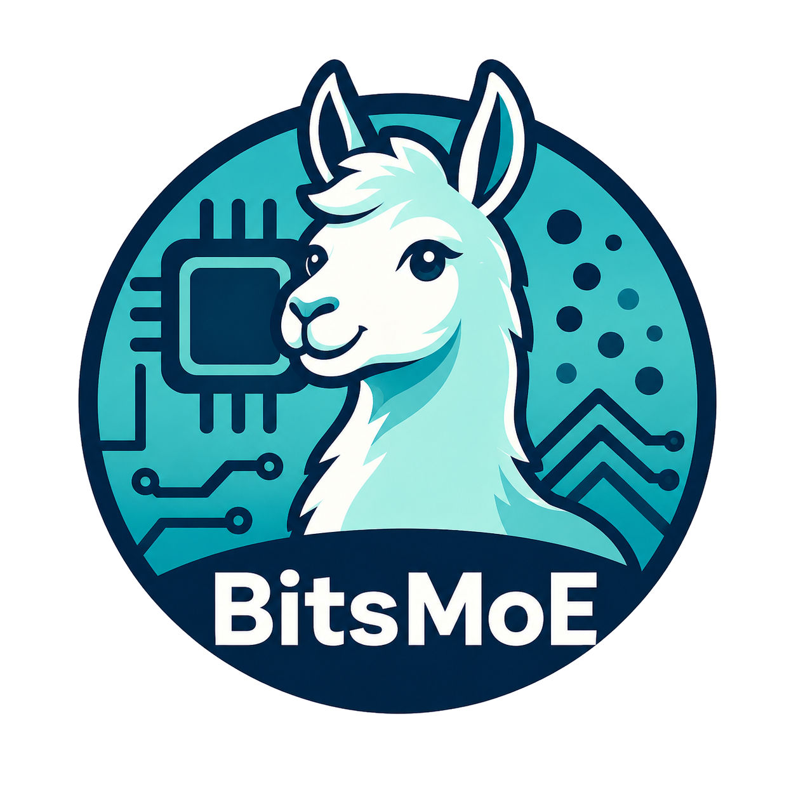

# BitsMoE: Efficient Spectral Energy-Guided Bit Allocation for MoE LLM Quantization

<p align="center">
  
</p>

<p align="center">
    <a href=""></a>
    <a href="https://huggingface.co/zjiayu064"></a>
    <a href="https://arxiv.org/licenses/nonexclusive-distrib/1.0/license.html"></a>
    <a href="https://opensource.org/license/mit/"></a>
</p>

<p align="center">
  <b><a href="#preparation">🧩 Preparation</a></b> •
  <b><a href="#environment">🛠️ Environment</a></b> •
  <b><a href="#models">📦 Models</a></b> •
  <b><a href="#evaluation-config">⚙️ Evaluation Config</a></b> •
  <b><a href="#citation">📌 Citation</a></b>
</p>

---

<a id="preparation"></a>

## Preparation

```bash
git submodule update --init --recursive
curl -LsSf https://astral.sh/uv/install.sh | sh
```

<a id="environment-compatibility"></a>

## Environment Compatibility

- **CUDA Toolkit 12.8** (`nvcc -V` should show `release 12.8`)
- **GCC / G++ ≥ 12.0**
- Tested and recommended: **GCC/G++ 14.2.0**
- **Python 3.12** is recommended
- Other compiler/CUDA/Python combinations are currently not tested

<a id="environment"></a>

## Environment

Choose **one** method below.

### One-command install (**Recommended**):

```bash
bash scripts/install_env.sh
```

### Manual install:

```bash
conda create -n bitsmoe python=3.12 -y
conda activate bitsmoe
uv pip install torch==2.8.0 torchvision==0.23.0 torchaudio==2.8.0 --index-url https://download.pytorch.org/whl/cu128
uv pip install packaging ninja psutil
uv pip install flash-attn --no-build-isolation
uv pip install flash-linear-attention --no-build-isolation
uv pip install --no-binary=causal-conv1d "git+https://github.com/Dao-AILab/causal-conv1d.git" --no-build-isolation
cd bitsmoe/evaluation/lm_eval
uv pip install -e .
cd ../../..
uv pip install -e . --no-build-isolation
```

<a id="quick-start"></a>

## Quick Start

By default, models are downloaded from Hugging Face (Transformers cache).

Run one inference demo (PPL):

```bash
bitsmoe demo
```

Run evaluation from YAML config:

```bash
bitsmoe eval --config configs/deepseekv2/eval.yaml
bitsmoe eval --config configs/qwen3moe/eval.yaml
bitsmoe eval --config configs/qwen3next/eval.yaml
```

<a id="models"></a>

## 📦 Models


| Base Model | Precision | Hugging Face Repo | Access Link |
| --- | --- | --- | --- |
| deepseek-ai/DeepSeek-V2-Lite | 2-bit | `zjiayu064/DeepSeek-V2-Lite-BitsMoE-2bit` | [🤗 DeepSeek-V2-Lite-BitsMoE-2bit](https://huggingface.co/zjiayu064/DeepSeek-V2-Lite-BitsMoE-2bit) |
| Qwen/Qwen3-30B-A3B-Base | 2-bit | `zjiayu064/Qwen3-30B-A3B-Base-BitsMoE-2bit` | [🤗 Qwen3-30B-A3B-Base-BitsMoE-2bit](https://huggingface.co/zjiayu064/Qwen3-30B-A3B-Base-BitsMoE-2bit) |
| Qwen/Qwen3-Next-80B-A3B-Instruct | 2-bit | `zjiayu064/Qwen3-Next-80B-A3B-Instruct-BitsMoE-2bit` | [🤗 Qwen3-Next-80B-A3B-Instruct-BitsMoE-2bit](https://huggingface.co/zjiayu064/Qwen3-Next-80B-A3B-Instruct-BitsMoE-2bit) |

<a id="evaluation-config"></a>

## Evaluation Config (`eval.yaml`)

The main runtime configuration is in:

- `configs/deepseekv2/eval.yaml`
- `configs/qwen3moe/eval.yaml`
- `configs/qwen3next/eval.yaml`

These fields follow the usage of [EleutherAI/lm-evaluation-harness](https://github.com/EleutherAI/lm-evaluation-harness):

- `lm_eval.model`: backend type (for example `hf`)
- `lm_eval.model_args`: model constructor arguments (for example `pretrained`, `dtype`)
- `lm_eval.tasks`: benchmark task list
- `lm_eval.apply_chat_template`: whether to apply chat template
- `lm_eval.batch_size`: batch size or `auto`
- `lm_eval.extra_args`: extra `lm-eval` flags
- `ppl`: perplexity evaluation settings
- `runtime.seed`: random seed

Current tasks:

- `mmlu`
- `hellaswag`
- `winogrande`
- `openbookqa`
- `mathqa`

<a id="quantization"></a>

## Quantization

This repository is currently **inference-only**.

- Released now: runtime kernels, model patching logic, and 2-bit checkpoints for evaluation/inference.
- Not released yet: end-to-end quantization/preprocessing pipeline.

Planned open-source items:

- Quantization configs and reproducible command examples
- Calibration/data preparation workflow
- Validation report (quality and efficiency deltas)

Status: **Coming soon**.

## License

- Code repository: MIT
- Paper (arXiv): arXiv.org perpetual, non-exclusive license 1.0

<a id="citation"></a>

## Citation

```bibtex

```
